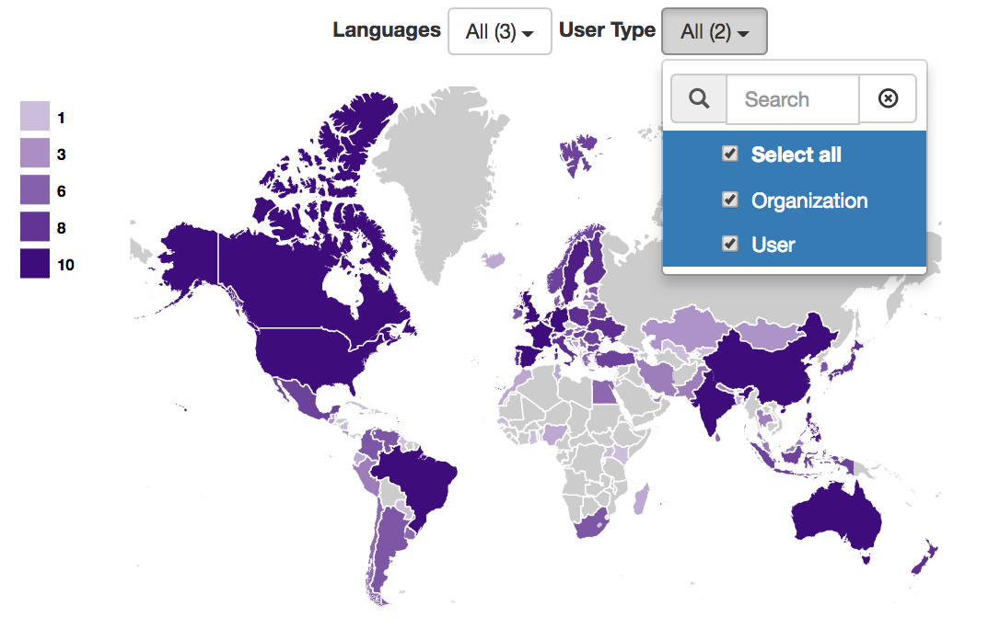
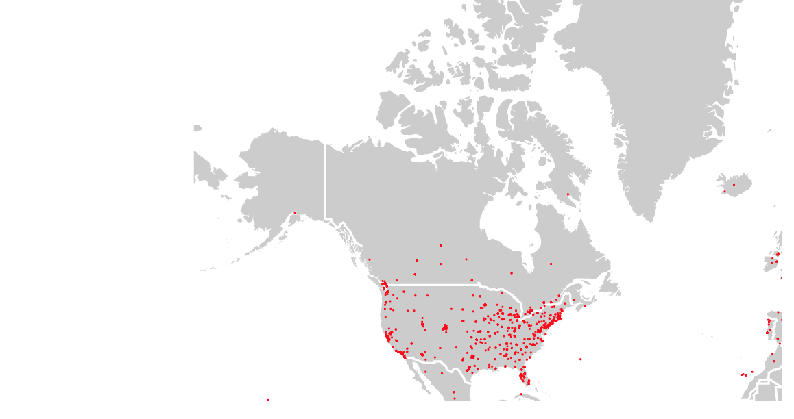
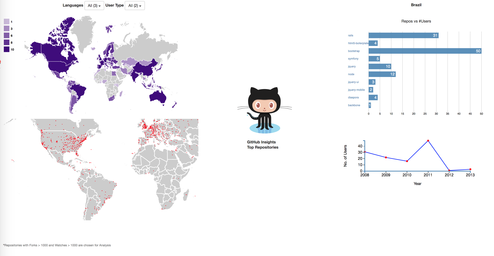

# GitHub Viz
The projects provides insights on the users statistics and distribution of the top programming languages in the world.

# Requirements
- [D3](https://d3js.org/)
- Web Server

# Idioms
- Choropleth World Maps
- Line Chart
- Bar Chart

# Features
### Repositories Distribution
- A choropleth world map is used to show the distribution of programming languages across all the countries in the world.
- The results can be filtered based on language and user type (organization & user).

### User Distribution
- Users from various countries are encoded as red dots on a choropleth world map.
- User distribution of selected country is presented by the zoomed choropleth world map II.

### Screenshots
- The no. of repositories in the selected country is shown in the bar chart.
- The trend in the no. of users per year is visualized using line chart.

  | Repositories Distribution                                             | User Distribution          |
  |------------------------------------------------------------|------------------------------------------------------------|
  |          |       |

| Repositories Distribution                                             |
  |------------------------------------------------------------|
  |          |
